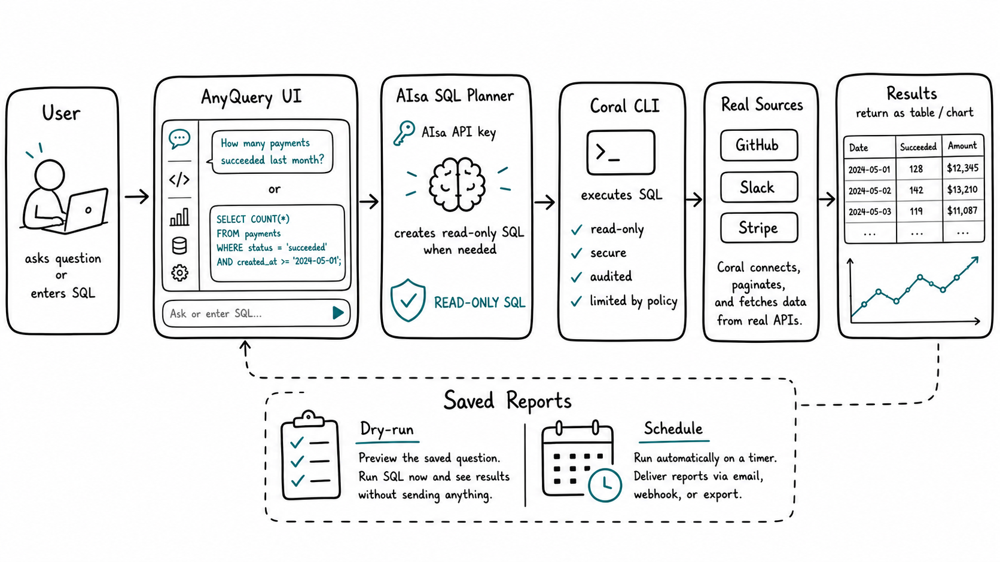

# AnyQuery



AnyQuery is a Coral-native data assistant prototype. It is intentionally wired to real Coral only:

- Ask with read-only SQL immediately.
- Generate SQL from natural language only when AIsa is configured.
- Validate SQL before execution.
- Execute through `coral sql`.
- Return an answer, result table, chart recommendation, and provenance from the real Coral response.
- Inspect Coral source availability and the live Coral catalog.
- Install bundled Coral sources by passing required inputs directly to `coral source add`.
- Lint and install custom source specs through `coral source lint` and `coral source add --file`.
- Save questions, create report schedules, and investigate saved metrics.
- Use Kokonut UI components for the primary command/search and toolbar surfaces.

## Requirements

- Node.js 20+
- Coral CLI on `PATH`

Install Coral with Homebrew:

```bash
brew install withcoral/tap/coral
```

Confirm:

```bash
coral --version
coral source discover
```

## Run

```bash
npm install
npm run dev
```

Web app: http://127.0.0.1:5173

API: http://127.0.0.1:8787

The app does not fabricate source data. If no Coral sources are configured, you can still query Coral metadata:

```sql
SHOW TABLES
```

```sql
SELECT table_schema, table_name, table_type
FROM information_schema.tables
ORDER BY table_schema, table_name
LIMIT 50
```

To connect real product data, install a Coral source:

```bash
coral source info github
GITHUB_TOKEN=... coral source add github
coral source list
```

The app also exposes this flow in the source inspector. Required source inputs are read from `coral source info -v`; submitted values are passed to the Coral subprocess and are not stored in `data/app-state.json`.

Natural-language prompts use AIsa's chat completions endpoint. Configure an AIsa key before starting the app:

```bash
AISA_API_KEY=... npm run dev
```

Or put it in a local `.env` file:

```bash
AISA_API_KEY=...
AISA_MODEL=gpt-4.1-mini
AISA_BASE_URL=https://api.aisa.one/v1
```

The default AIsa model is `gpt-4.1-mini`. Override it with `AISA_MODEL=gpt-4.1` or another AIsa-supported model ID. The default base URL is `https://api.aisa.one/v1`; override it with `AISA_BASE_URL` if needed.

## UI Components

Kokonut UI is configured through `components.json` with the `@kokonutui` registry namespace. Tailwind CSS v4 is wired through Vite, and local Kokonut-derived components live in `src/components/kokonutui`.

## Verify

```bash
npm run verify
```

The verification gate runs ESLint, Vitest, TypeScript, and the Vite production build. Tests are terminal-only and execute against the real Coral CLI.

## Coral Boundary

AnyQuery owns app metadata such as threads, saved questions, schedules, metrics, and run history. Coral owns source configuration and credentials. The app calls Coral through `CoralGateway`; no source data is invented when Coral is unavailable.
